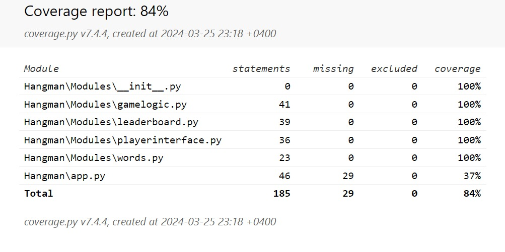
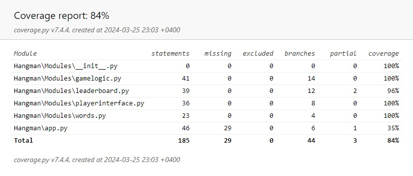
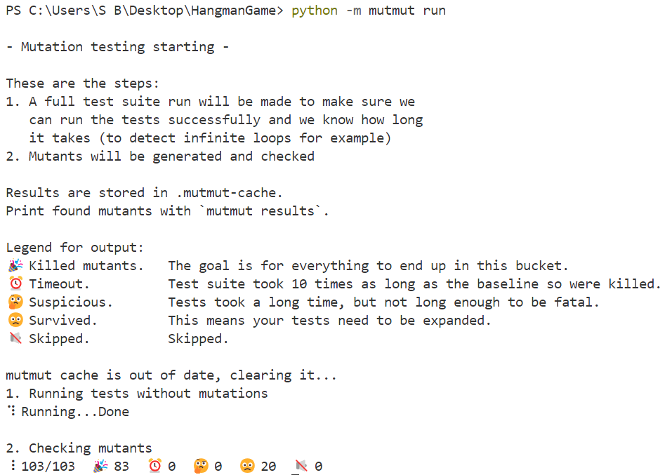

# Hangman
This project is a hangman game where players guess letters to try and reveal a hidden word using a console-based interface. The goal is to identify the word before the allowed attempts run out and the stick figure is hung.   

The features of the game include:
- The hangman character which becomes increasingly visible upon a wrong guess
- A console interface that allows the user to enter letters and displays the current state of the word (letters revealed and those still hidden) 
- A leaderboard which shows the scores of previous players

The hidden word is selected from a a database of words which cover 5 categories: animals, programming languages, fruits, stationary, types of vehicles

## Tools & Technologies

The game was developed using the following tools and technologies:
- **Implementation language**: Python
- **Unit-Testing Framework**: Pytest
- **Mocking Framework**: Pytest-mock
- **Code Coverage Tool**: Pytest-cov
- **Mutation Testing Framework**: mutmut

### Prerequisites

Before you can run this project, you will need to have Python 3.9 or later installed. 

You can check if you have Python installed by running the following command in your terminal:

```bash
python --version
```

To carry out unit-testing, mocking, mutation testing, and to view code coverage the pytest, pytest-mock, pytest-cov mutmut tools must be installed. This can be done via the following command:
   
```bash
pip install pytest pytest-mock pytest-cov mutmut
```

## How to Build and Run
To be able to execute the code for the game:

### Clone the Repository
```bash
git clone https://github.com/itSanjaya/HangmanGame.git
```

or 

```bash
git clone git@github.com:itSanjaya/HangmanGame.git
```

### Navigate to the Project Directory

```bash
cd HangmanGame
```

### Run the Game
Navigate to the Hangman directory: ``` cd HangmanGame ```

Then run the following command in the terminal:

```
python Hangman/app.py
```

The hangman game should then start.

### Run Tests and Generate Statement & Branch Coverage Report
**Note:** To run the tests successfully, ensure you're located directly within ```HangmanGame``` and not further in any subdirectory within the folder structure.

To run the tests with pytest and generate the statement coverage report for the unit tests, use the following command:

```
python -m pytest --cov=. --cov-report=term --cov-report=html --cov-config=.coveragerc
```

To run the tests with pytest and generate the branch coverage report for the unit tests, use the following command:

```
python -m pytest --cov=. --cov-branch --cov-report=term --cov-report=html --cov-config=.coveragerc
```

The report can then be found at the following location:
```
HangmanGame/htmlcov/index.html
```

### Run Mutation Tests
**Note:** To run the tests successfully, ensure you're located directly within ```HangmanGame``` and not further in any subdirectory within the folder structure.

To carry out mutation testing, use the following command:

```
python -m mutmut run
```

To view the results and mutation score, use the following command:

```
mutmut results
```

The results will then be displayed in the command line. 

## Achieved Statement Coverage  
<div align="center">
   
</div>

## Achieved Branch Coverage
<div align="center">
   
</div>

## Achieved Mutation Score
<div align="center">
   
</div>

Therefore the final mutation score was (83/103) * 100 = 80.58%

In conducting mutation testing, we encountered substantial difficulties, particularly with the app.py and leaderboard.py modules. Despite a comprehensive suite of _ tests that successfully passed, achieving a mutation testing score of 80% was challenging. The primary issue with app.py stemmed from its complex integration of multiple classes, which proved difficult to mock effectively. This complexity was a significant factor that hindered our ability to meet the desired mutation testing thresholds.

Additionally, we faced challenges with leaderboard.py, where the mutants had very slight differences, making them difficult to detect and adequately test. This complexity was exemplified by an encountered error: ```ValueError: too many values to unpack (expected 2)```. This error occurred while the code interacted with the data from the database, specifically, the score table, which introduced an additional layer of complexity to the mutation testing process and was a critical factor contributing to the difficulty in resolving the error. However, our work to resolve these challenges emphasizes the difficulty of reaching high mutation testing scores in such scenarios.

### Killing Live Mutants 

#### Example 1
We updated the _init_ of leaderboard.py to add a case when the database could be empty or none. Initially, we had a mutant ```sql_player_rank = None ``` instead of the SQL query that was assigned to sql_player_rank. This was failing because we didn’t handle the database being empty or not. We updated the code and added more test cases. This killed the mutant and passed the test cases.

New code:
```
    def _init_(self, db):
        if not db:
            raise ValueError("Database cannot be None or empty.")
        self.db = db
```


#### Example 2
The generate_leaderboard function was refactored by converting player_rank into an integer right after finding it with next(). 

We fixed the test case by updating the data structure such that the database responses mock_cursor.fetchall.side_effect are accurate representations of what the generate_leaderboard method would receive from an actual database query. The mutant was tested with other data types. Fixing to a specific data type, helped us pass the test cases and kill the mutant  The updated test is a corrected and more precise version that should avoid the ValueError issues that occurred previously.

## Static Analysis Report
The static analysis report for the Hangman project can be found [here](/StaticAnalysis.md).
